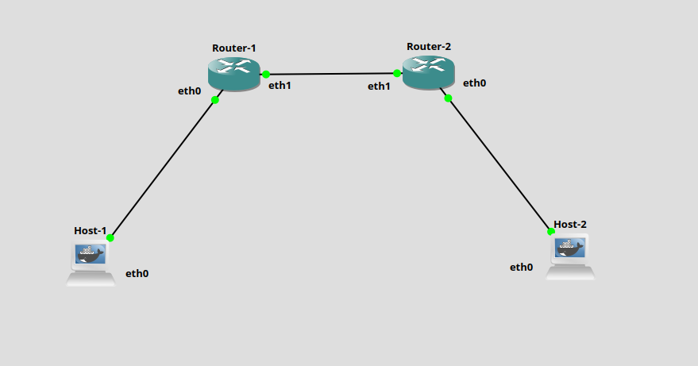
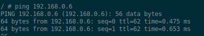

# Topology 1 - Basic Routing

## Overview

Two hosts communicating through two routers using static routes.
This is the simplest possible routed network. No dynamic routing protocol,
just manually configured IP addresses and static routes.

## Topology



## Concepts covered

- IP addressing and subnets
- Static routing
- Default gateway
- TTL (how it decrements at each hop)
- `/30` subnets for point-to-point links

## IP plan

| Device | Interface | IP |
|--------|-----------|----|
| host-1 | eth0 | 192.168.0.2/30 |
| router-1 | eth0 | 192.168.0.1/30 |
| router-1 | eth1 | 192.168.0.9/30 |
| router-2 | eth1 | 192.168.0.10/30 |
| router-2 | eth0 | 192.168.0.5/30 |
| host-2 | eth0 | 192.168.0.6/30 |

## How to run

1. Build the Docker images from the root directory:
```bash
make
```

2. Open GNS3 and import the project:
`File → Import portable project → Topology-1-Basic-Routing.gns3project`

3. Start all nodes.

## Testing

From host-1, ping host-2:
```bash
ping 192.168.0.6
```

Expected output:



Notice `ttl=62`, the packet started with TTL 64 and was decremented
once by each router (2 routers = TTL 64 - 2 = 62).

## What happens step by step

1. host-1 wants to reach `192.168.0.6`, not on its subnet, so it sends the packet to its **default gateway** (router-1 `192.168.0.1`)
2. router-1 checks its routing table, sees `192.168.0.4/30` is reachable via `192.168.0.10`, forwards the packet to router-2
3. router-2 checks its routing table, sees `192.168.0.4/30` is directly connected on `eth0`, delivers the packet to host-2
4. host-2 replies, same path in reverse