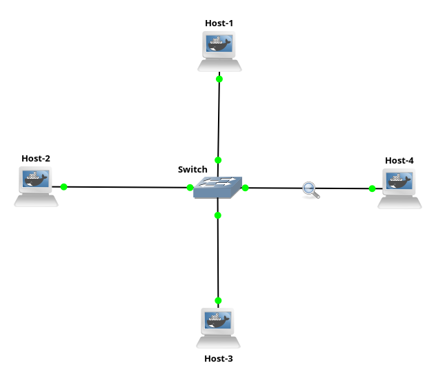

# Topology 2 - L2 Switching

## Overview

Four hosts connected to a central switch. No routing, no IPs needed at the
switch level, pure Layer 2 forwarding using MAC addresses.

## Topology



## Concepts covered

- Layer 2 switching
- MAC addresses
- MAC address table (CAM table)
- Unknown unicast flooding
- ARP (Address Resolution Protocol)

## Why a switch and not just cables ?

You might wonder, why not just connect every host to every other host
directly with a cable ? With 4 hosts that would mean 6 cables (one between
each pair). With 10 hosts it would be 45 cables. With 100 hosts it becomes
impossible.

A switch solves this by acting as a central connection point. Every host
plugs into the switch with a single cable, and the switch handles forwarding
frames between them intelligently.

## How a switch learns where every host is

A switch starts with an empty MAC table, it has no idea which host is
connected to which port. It learns purely by observing traffic:

1. When a frame arrives on a port, the switch reads the source MAC address
   and records: "this MAC is reachable on this port"
2. It looks up the destination MAC in its table
3. If found, it forwards the frame only to that port (unicast forwarding)
4. If not found, it sends the frame out of all ports except the one it came
   in on (unknown unicast flooding)

Over time the switch builds a complete MAC table and stops flooding.

**Example MAC table after hosts have communicated:**

| MAC address | Port |
|-------------|------|
| 02:42:05:4a:e9:00 | 0 (Host-1) |
| 02:42:3a:3e:0c:01 | 1 (Host-2) |
| 02:42:7b:95:fc:00 | 2 (Host-3) |
| 02:42:4e:2e:54:01 | 3 (Host-4) |

The switch will build a similar table based on the actual MAC addresses
of your containers.

## ARP - how hosts find each other's MAC address

The switch only forwards frames, it does not help hosts find each other's
MAC address. That is ARP's job.

When host-2 wants to ping host-4 it knows the destination IP but not its
MAC address. So it broadcasts an ARP request:

**"Who has 192.168.0.4? Tell 192.168.0.2"**


- The source MAC is host-2
- The destination is Broadcast, meaning every host on the network receives it
- The switch floods this frame out of all ports since broadcast is never in
  the MAC table

Host-4 recognizes its own IP and replies directly to host-2 with its MAC address:


From that point, host-2 knows host-4's MAC and can send frames directly.
The switch learns both MACs during this exchange.

## IP plan

| Device | Interface | IP |
|--------|-----------|----|
| Host-1 | eth0 | 192.168.0.1/24 |
| Host-2 | eth0 | 192.168.0.2/24 |
| Host-3 | eth0 | 192.168.0.3/24 |
| Host-4 | eth0 | 192.168.0.4/24 |

No IP is configured on the switch, it operates purely at Layer 2.

## How to run

1. Build the Docker images from the root directory:
```bash
make
```

2. Open GNS3 and import the project:
`File -> Import portable project -> Topology-2-L2-Switching.gns3project`

3. Start all nodes.

## Testing

From Host-2, ping Host-4:
```bash
ping 192.168.0.4
```

Capture traffic on any link between a host and the switch in Wireshark
to observe ARP and ICMP frames in action.