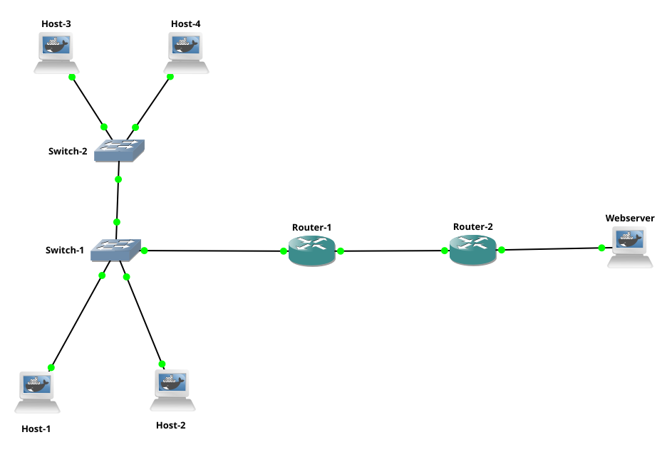

# Topology 3 - Routing and Switching

## Overview

A small office network where multiple hosts share a switched LAN and communicate
with a remote webserver through two routers. This topology combines Layer 2
switching and Layer 3 routing in a realistic setup.

## Topology



## Concepts covered

- Cascading switches
- MAC table learning across multiple switches
- Default gateway
- Inter-network routing with static routes
- Combined L2 and L3 forwarding

## Why multiple switches ?

Beyond the obvious port limitation reason, multiple switches are used for:

**Physical distance** : a single switch has a limited cable length. In a
building with multiple floors, you put a switch on each floor and connect
them together with an uplink.

**Traffic segmentation** : devices that communicate heavily with each other
are grouped on the same switch, reducing traffic on the uplinks between switches.

**Hierarchy** : in large networks switches are organized in layers:
- Access layer: switches where end devices connect (Switch2 in this topology)
- Distribution layer: switches that aggregate access switches (Switch1 in this topology)
- Core layer: high speed switches handling backbone traffic

**Redundancy** : in production networks switches are connected in a way that
if one fails, traffic reroutes through another path.

## How flood, learn and forward works here

When Host-1 wants to reach Host-4 for the first time:

1. Host-1 sends an ARP broadcast "Who has 192.168.0.5?"
2. Switch1 receives it on Host-1's port, learns "Host-1 MAC is on port X"
3. Switch1 doesn't know where Host-4 is so it floods the frame out of all
   ports including the uplink to Switch2 and Router-1
4. Switch2 receives the frame, learns "Host-1 MAC is reachable via the
   port connected to Switch1"
5. Switch2 floods out of all its ports including Host-3 and Host-4
6. Host-4 recognizes its IP and sends an ARP reply back to Host-1
7. Switch2 learns "Host-4 MAC is on port Y"
8. Switch1 learns "Host-4 MAC is reachable via the port connected to Switch2"

From this point both switches have learned the MACs and forward directly
without flooding.

**Example MAC table of Switch1 after hosts have communicated:**

| MAC address | Port | Device |
|-------------|------|--------|
| 02:42:c0:a8:00:02 | 0 | Host-1 (direct) |
| 02:42:c0:a8:00:03 | 1 | Host-2 (direct) |
| 02:42:c0:a8:00:04 | 2 | Host-3 (via Switch2) |
| 02:42:c0:a8:00:05 | 2 | Host-4 (via Switch2) |
| 02:42:c0:a8:00:01 | 3 | Router-1 (direct) |

Notice that Host-3 and Host-4 both map to port 2 (the uplink to Switch2).
Switch1 knows they are reachable through that port but does not know which
specific port they are on inside Switch2.

## IP plan

| Device | Interface | IP | Subnet |
|--------|-----------|----|--------|
| Host-1 | eth0 | 192.168.0.2/28 | LAN |
| Host-2 | eth0 | 192.168.0.3/28 | LAN |
| Host-3 | eth0 | 192.168.0.4/28 | LAN |
| Host-4 | eth0 | 192.168.0.5/28 | LAN |
| Router-1 | eth0 | 192.168.0.1/28 | LAN |
| Router-1 | eth1 | 172.16.0.1/30 | WAN |
| Router-2 | eth1 | 172.16.0.2/30 | WAN |
| Router-2 | eth0 | 10.0.0.1/30 | Server |
| Webserver | eth0 | 10.0.0.2/30 | Server |

## How to run

1. Build the Docker images from the root directory:
```bash
make
```

2. Open GNS3 and import the project:
`File -> Import portable project -> Topology-3-Routing-and-Switching.gns3project`

3. Start all nodes.

## Testing

From Host-1, ping the Webserver:
```bash
ping 10.0.0.2
```

From Host-1, ping Host-4:
```bash
ping 192.168.0.5
```

Capture traffic on the link between Switch1 and Switch2 in Wireshark to
observe how ARP broadcasts are flooded across both switches before the
MAC tables are populated.