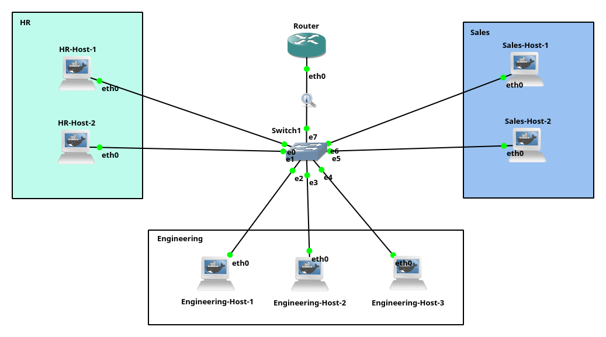
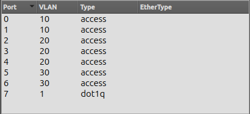
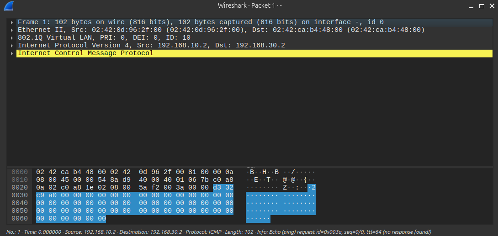
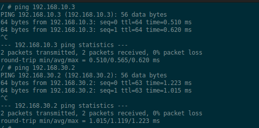

# Topology 4 - VLANs

## Overview

A company network with three departments (HR, Engineering, Sales) isolated
using VLANs on a single switch, with inter-VLAN routing handled by a single
router using the router-on-a-stick technique.

## Topology



## Concepts covered

- VLANs (Virtual Local Area Networks)
- Access ports vs trunk ports
- 802.1Q tagging
- Router on a stick
- Inter-VLAN routing

## Why VLANs ?

Without VLANs, all hosts connected to the same switch are in the same
broadcast domain. Everyone sees everyone's ARP broadcasts, and any host
can reach any other host directly. This is a security and performance problem
in a company environment where different departments should be isolated.

VLANs solve this by logically segmenting a single physical switch into
multiple isolated networks. A host in HR cannot directly reach a host in
Engineering even though they are physically connected to the same switch.
Traffic between VLANs must go through a router.

## Access ports vs trunk ports

**Access port** : assigned to a single VLAN. Connects to end hosts. The host
sends and receives normal untagged frames and has no idea it is in a VLAN.
The switch adds the VLAN tag internally when the frame enters and removes it
before delivering to the destination host.

**Trunk port** : carries multiple VLANs on a single link. Used between switches
or between a switch and a router. Frames are tagged with a VLAN ID using the
802.1Q standard so the receiving device knows which VLAN each frame belongs to.

## Switch port configuration



## Router on a stick

The router connects to the switch via a single physical interface (eth0)
configured as a trunk port. On the router side, that interface is divided
into sub-interfaces, one per VLAN:

- `eth0.10` - gateway for VLAN 10 (HR): `192.168.10.1/28`
- `eth0.20` - gateway for VLAN 20 (Engineering): `192.168.20.1/28`
- `eth0.30` - gateway for VLAN 30 (Sales): `192.168.30.1/28`

One physical cable doing the work of three logical links. That is why it
is called router on a stick.

## 802.1Q tagging in action

When HR-Host-1 pings Sales-Host-1, the frame passes through the trunk link
tagged with VLAN 10. Wireshark captures this clearly:



The line `802.1Q Virtual LAN, PRI: 0, DEI: 0, ID: 10` confirms the frame
is tagged with VLAN ID 10 on its way to the router. The router strips the
tag, makes the L3 routing decision, and sends it back tagged VLAN 30 toward
Sales-Host-1.

## Proof that VLANs and inter-VLAN routing work



- Pinging `192.168.10.3` from `192.168.10.2` returns `ttl=64`, same VLAN,
  no router involved, pure L2 forwarding
- Pinging `192.168.30.2` from `192.168.10.2` returns `ttl=63`, different
  VLAN, packet went through the router, TTL decremented by 1

The TTL difference is proof that intra-VLAN traffic stays at L2 while
inter-VLAN traffic goes through the router.

## IP plan

| Device | Interface | IP | VLAN |
|--------|-----------|----|------|
| Router | eth0.10 | 192.168.10.1/28 | 10 (HR) |
| Router | eth0.20 | 192.168.20.1/28 | 20 (Engineering) |
| Router | eth0.30 | 192.168.30.1/28 | 30 (Sales) |
| HR-Host-1 | eth0 | 192.168.10.2/28 | 10 |
| HR-Host-2 | eth0 | 192.168.10.3/28 | 10 |
| Engineering-Host-1 | eth0 | 192.168.20.2/28 | 20 |
| Engineering-Host-2 | eth0 | 192.168.20.3/28 | 20 |
| Engineering-Host-3 | eth0 | 192.168.20.4/28 | 20 |
| Sales-Host-1 | eth0 | 192.168.30.2/28 | 30 |
| Sales-Host-2 | eth0 | 192.168.30.3/28 | 30 |

## How to run

1. Build the Docker images from the root directory:
```bash
make
```

2. Open GNS3 and import the project:
`File -> Import portable project -> Topology-4-VLANs.gns3project`

3. Start all nodes.

## Testing

From HR-Host-1, ping another HR host (same VLAN):
```bash
ping 192.168.10.3
```

From HR-Host-1, ping a Sales host (inter-VLAN):
```bash
ping 192.168.30.2
```

Capture traffic on the trunk link between Switch1 and the Router in
Wireshark to observe the 802.1Q tags.