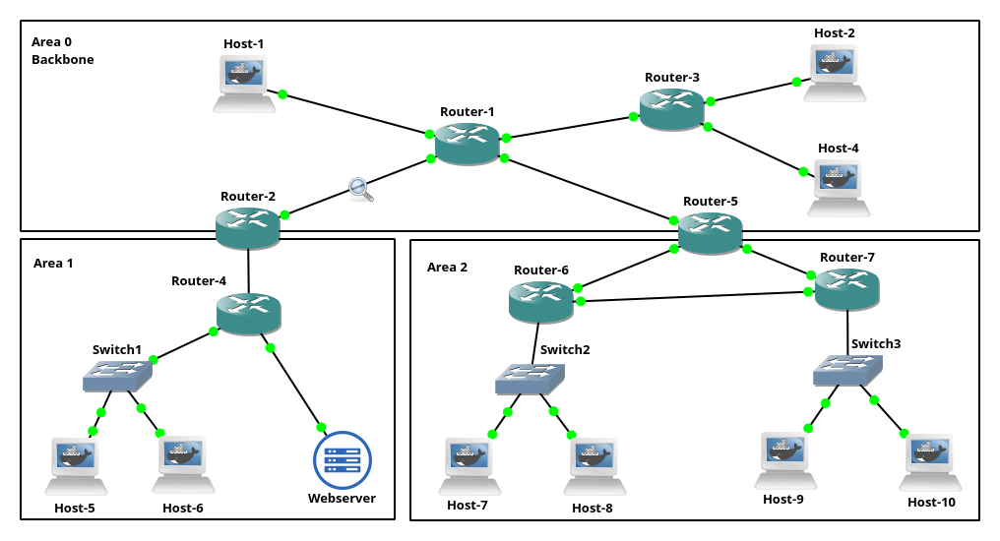
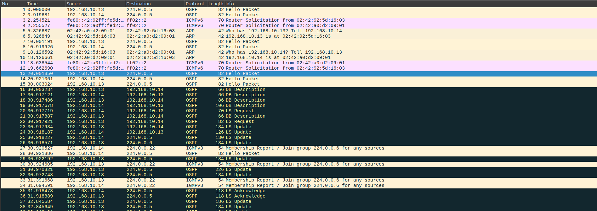
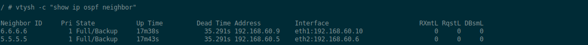
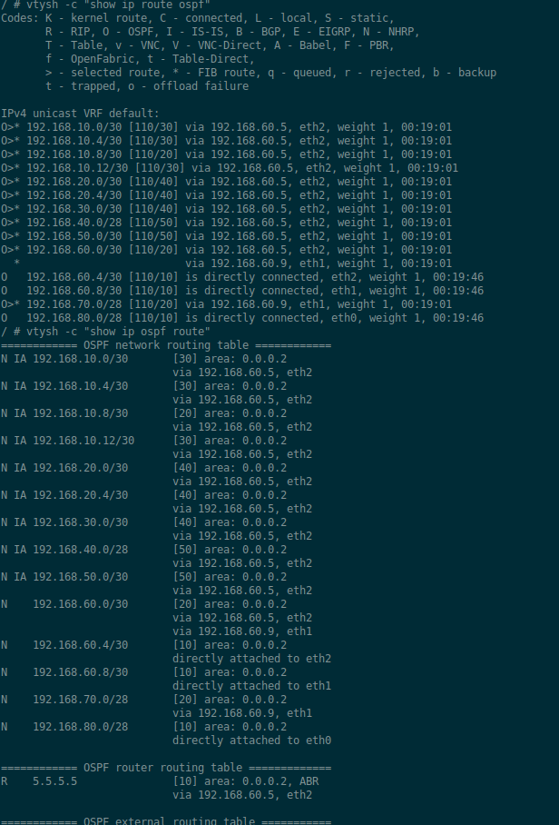
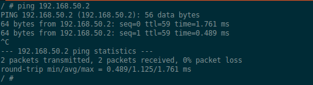

# Topology 5 - OSPF

## Overview

A multi-area enterprise network running OSPF as its dynamic routing protocol.
No static routes anywhere - routers discover each other, exchange network
information, and build their routing tables automatically.

## Topology



## Concepts covered

- OSPF (Open Shortest Path First)
- Link-state routing vs distance-vector
- OSPF areas and the backbone (Area 0)
- Area Border Routers (ABRs)
- Router IDs and loopback interfaces
- Neighbor adjacencies and the Full state
- Link State Advertisements (LSAs)
- SPF algorithm
- Dynamic route convergence

## Why dynamic routing ?

In Topology 1 and 3 we configured static routes manually on each router.
That works fine with 2 routers but becomes impossible to maintain at scale.
With 7 routers and dozens of subnets, a single link failure would require
manually updating every affected router.

OSPF solves this by letting routers talk to each other. Each router
advertises its directly connected networks to its neighbors, neighbors
forward that information further, and eventually every router in the network
has a complete map of the topology. If a link goes down, routers detect it
and automatically recalculate their routes around the failure.

## Why OSPF uses areas

A single large OSPF domain has a problem - every router must store the
complete topology of the entire network in its Link State Database (LSDB).
With hundreds of routers this becomes expensive in memory and CPU.

Areas solve this by dividing the network into zones. Routers inside an area
only know the detailed topology of their own area. Inter-area routing is
summarized by Area Border Routers (ABRs) before being advertised into the
backbone.

Area 0 is mandatory - it is the backbone that all other areas must connect
to. All inter-area traffic flows through Area 0.

In this topology:
- Area 0 (Backbone): Router-1, Router-2, Router-3, Router-5
- Area 1: Router-4 (connected to Area 0 via Router-2)
- Area 2: Router-6, Router-7 (connected to Area 0 via Router-5)

Router-2 and Router-5 are ABRs - they belong to two areas simultaneously
and are responsible for summarizing and redistributing routes between them.

## Router IDs

Each router needs a unique identifier in the OSPF domain. We use loopback
addresses as router IDs because loopback interfaces never go down, making
the ID stable even when physical links fail.

| Router | ID |
|--------|----|
| Router-1 | 1.1.1.1 |
| Router-2 | 2.2.2.2 |
| Router-3 | 3.3.3.3 |
| Router-4 | 4.4.4.4 |
| Router-5 | 5.5.5.5 |
| Router-6 | 6.6.6.6 |
| Router-7 | 7.7.7.7 |

## How OSPF neighbors form

When OSPF starts on a router, it sends Hello packets to the multicast
address `224.0.0.5` (All OSPF Routers). Any router running OSPF on the
same link receives the Hello and responds.

The two routers then go through a series of states:
1. Down - no Hellos received yet
2. Init - Hello received but not yet acknowledged
3. 2-Way - both routers see each other in Hello packets
4. ExStart - beginning database synchronization
5. Exchange - exchanging Database Description packets summarizing their LSDBs
6. Loading - requesting missing LSAs
7. Full - databases are synchronized, adjacency complete

Once Full state is reached, the routers actively exchange routing information.

## OSPF packet types

OSPF uses five packet types:

- Hello: discovers neighbors and maintains adjacencies, sent every 10 seconds
- Database Description (DBD): summarizes LSDB contents during adjacency formation
- Link State Request (LSR): requests specific LSAs from a neighbor
- Link State Update (LSU): carries the actual LSAs
- Link State Acknowledgment (LSAck): confirms LSA reception

## OSPF exchange captured in Wireshark



The capture on the link between Router-1 and Router-2 shows the complete
neighbor formation process. You can observe Hello packets being sent to
`224.0.0.5`, followed by DBD, LSR, and LSU packets as the two routers
synchronize their databases.

## OSPF neighbor adjacencies



Router-7 has formed Full adjacencies with both its neighbors in Area 2.
Neighbor `5.5.5.5` (Router-5) is reachable via `192.168.60.5` and neighbor
`6.6.6.6` (Router-6) is reachable via `192.168.60.9`. Both are in Full
state confirming complete database synchronization.

## OSPF route learning



Router-7's routing table is fully populated with OSPF routes to every subnet
in the topology including networks in Area 0 and Area 1 that it has never
directly seen. Routes learned via OSPF appear with the `O` code:

```
O>* 192.168.10.0/30 [110/30] via 192.168.60.5
```

Where `110` is the OSPF administrative distance and `30` is the cost
(number of hops multiplied by interface cost). The higher the cost the
less preferred the route.

## End-to-end connectivity



Host-10 in Area 2 successfully pings the Webserver in Area 1. The packet
traverses Router-7, Router-5 (ABR), Router-1 (backbone), Router-2 (ABR),
Router-4, and finally reaches the Webserver. The TTL is lower than 64
because each router decrements it by 1.

## IP plan

| Device | Interface | IP | Area |
|--------|-----------|----|------|
| Router-1 | eth0 | 192.168.10.1/30 | 0 |
| Router-1 | eth1 | 192.168.10.5/30 | 0 |
| Router-1 | eth2 | 192.168.10.9/30 | 0 |
| Router-1 | eth3 | 192.168.10.13/30 | 0 |
| Router-2 | eth0 | 192.168.30.1/30 | 1 |
| Router-2 | eth1 | 192.168.10.14/30 | 0 |
| Router-3 | eth0 | 192.168.20.1/30 | 0 |
| Router-3 | eth1 | 192.168.20.5/30 | 0 |
| Router-3 | eth2 | 192.168.10.6/30 | 0 |
| Router-4 | eth0 | 192.168.40.1/28 | 1 |
| Router-4 | eth1 | 192.168.50.1/30 | 1 |
| Router-4 | eth2 | 192.168.30.2/30 | 1 |
| Router-5 | eth0 | 192.168.60.1/30 | 2 |
| Router-5 | eth1 | 192.168.60.5/30 | 2 |
| Router-5 | eth2 | 192.168.10.10/30 | 0 |
| Router-6 | eth0 | 192.168.70.1/28 | 2 |
| Router-6 | eth1 | 192.168.60.9/30 | 2 |
| Router-6 | eth2 | 192.168.60.2/30 | 2 |
| Router-7 | eth0 | 192.168.80.1/28 | 2 |
| Router-7 | eth1 | 192.168.60.10/30 | 2 |
| Router-7 | eth2 | 192.168.60.6/30 | 2 |
| Webserver | eth0 | 192.168.50.2/30 | 1 |

## How to run

1. Build the Docker images from the root directory:
```bash
make
```

2. Open GNS3 and import the project:
`File -> Import portable project -> Topology-5-OSPF.gns3project`

3. Start all nodes.

4. OSPF configures itself automatically from the saved FRR config.

## Testing

Verify OSPF neighbors on any router:
```bash
vtysh -c "show ip ospf neighbor"
```

Verify routes learned through OSPF:
```bash
vtysh -c "show ip route ospf"
```

Ping the Webserver from Host-10:
```bash
ping 192.168.50.2
```

Capture traffic on any router-to-router link in Wireshark to observe
Hello packets, DBD exchange, and LSU flooding.