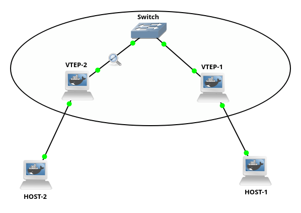
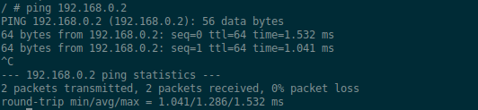
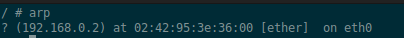

# Topology 6 - Static VXLAN

## Overview

Two hosts on different physical network segments communicating as if they
were on the same LAN, using a VXLAN tunnel between two routers acting as
VTEPs (VXLAN Tunnel Endpoints).

## Topology



## Concepts covered

- VXLAN (Virtual eXtensible Local Area Network)
- VTEPs (VXLAN Tunnel Endpoints)
- Overlay vs underlay network
- Linux bridge as a virtual switch
- L2 over L3 encapsulation
- Static unicast VXLAN

## Why VXLAN ?

In a data center, virtual machines from the same tenant need to communicate
at L2 - same broadcast domain, same subnet, direct MAC-to-MAC communication.
But physically those VMs might run on servers connected through a routed L3
network. L3 routing breaks L2 - once you route a packet you lose the original
Ethernet frame, ARP stops working across routers, and VMs can no longer be
on the same subnet.

VLANs partially solve this but are limited to 4096 IDs. A large cloud
provider with millions of tenants needs more. VXLAN extends this to over
16 million virtual networks using a 24-bit VNI (VXLAN Network Identifier).

VXLAN solves the problem by stretching L2 networks over L3 infrastructure.
The physical network runs L3 (routable, scalable), but on top of it VXLAN
creates virtual L2 segments. Hosts think they are on the same LAN even if
they are on different physical servers in different racks or different
data centers.

## How VXLAN works

Each VTEP has two roles:
- On the host side: receives normal untagged L2 frames from hosts
- On the network side: wraps those frames in UDP packets and sends them
  through the underlay network to the remote VTEP

The remote VTEP unwraps the UDP packet and delivers the original L2 frame
to its local host. The hosts never see any of this - from their perspective
they are on the same LAN.

```
host-1 sends L2 frame
-> arrives on VTEP-1 eth0
-> bridge forwards it to vxlan10
-> vxlan10 wraps it in UDP (port 4789), adds outer IP header
-> UDP packet travels through underlay (eth1) to VTEP-2
-> VTEP-2 unwraps the UDP packet
-> delivers original L2 frame to host-2
```

## What is a Linux bridge ?

A bridge is a virtual switch inside the Linux kernel. Just like a physical
switch has ports, a bridge has interfaces attached to it as slaves.

In this topology each VTEP has a bridge (`br0`) with two slaves:
- `eth0` - the host-facing interface
- `vxlan10` - the tunnel interface

When a frame arrives on `eth0` from the host, the bridge looks up the
destination MAC in its forwarding table and forwards it to `vxlan10`.
The bridge connects the host side and the tunnel side at L2 - it has no
concept of IP addresses or routing.

Without the bridge, `eth0` and `vxlan10` would be completely isolated
interfaces. The bridge is the glue that connects them.

## The VXLAN interface

`vxlan10` is a virtual network interface created by the kernel. It handles
all the encapsulation and decapsulation automatically:
- Outgoing frames: wraps them in UDP with the VXLAN header (VNI 10)
- Incoming UDP packets: strips the outer headers and delivers the inner
  L2 frame to the bridge

The kernel does all of this transparently - no userspace program is involved
in the actual packet processing.

## Proof that it works



Host-2 successfully pings host-1. Notice `ttl=64` - no router is involved,
this is pure L2 forwarding through the tunnel. If a router had been involved
the TTL would be 63 or lower.

## ARP works across the tunnel



Host-2's ARP table shows host-1's MAC address learned via ARP. This proves
that broadcast ARP requests from host-1 successfully traveled through the
VXLAN tunnel and